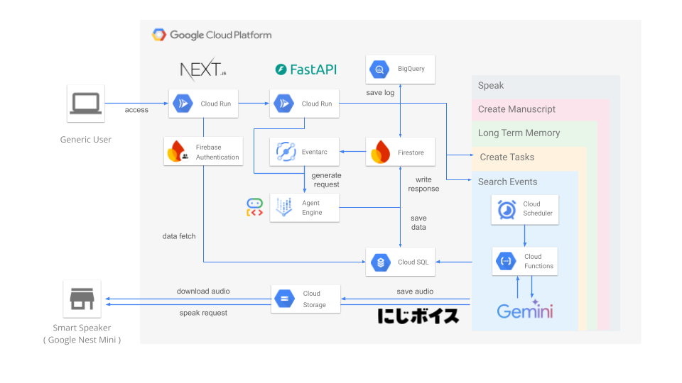

# Proxima へようこそ 👋

Proxima は **「一緒に強くなる！エンジニアの側で支える一生涯のバディ」** をコンセプトにした AI エージェント & ラーニングプラットフォームです。  
チャット、キャリアプランニング、デイリークエスト、情報収集など多彩な機能でエンジニアの成長を支援します。



## レポジトリ全体像

```text
proxima-app/
  agents/      ── AI Agent Engine (Python, Google ADK)
  api/         ── FastAPI サーバー。web ↔ agents の橋渡し
  web/         ── Next.js 14 App Router によるフロントエンド
  tasks/       ── Cloud Scheduler/Functions で実行する定期ジョブ
  iot/         ── Google Home & SwitchBot 連携用スクリプト
  documents/   ── 仕様書・設計資料
```

## 主な機能

💬 **チャット** — Proxima との自然な対話。雑談・相談・タスク操作をすべてここから
🏆 **キャリア & スキル管理** — 目標から逆算したキャリアプランとスキルマップ
📅 **デイリークエスト** — 毎日取り組める小さなタスクで習慣化を支援
🔍 **情報収集** — 最新イベント/記事/ツールを自動でリコメンド
📈 **振り返り & バッジ** — 実績を可視化しモチベーションを維持
🔊 **IoT リマインド** — Google Home が声で応援、SwitchBot で物理的リマインド

※このプロダクトは[にじボイスAPI](https://platform.nijivoice.com/)が利用されています。
※このプロダクトは[Connpass API](https://connpass.com/about/api/v2/)が利用されています。


## クイックスタート（ローカル開発）

### 前提

- Node.js 18+
- pnpm 8+ または npm
- Python 3.11+
- [uv](https://github.com/astral-sh/uv) / venv
- Docker (& Docker Compose v2)

### 1. リポジトリをクローン

```bash
git clone https://github.com/your-name/proxima-app.git
cd proxima-app
```

### 2. 環境変数を作成

各ディレクトリに `.env` サンプルがあります。必要に応じてコピーして編集してください。

```bash
cp api/.env.template api/.env
# ... その他サービスも同様
```

### 3. 依存パッケージをインストール

```bash
# Python (agents, api, tasks など)
uv pip install -r agents/pyproject.toml --system
uv pip install -r api/pyproject.toml --system

# Node (front)
cd web
pnpm install
cd ..
```

### 4. サービスを起動

```bash
# 個別に起動
pnpm --filter web dev               # http://localhost:3000
uvicorn api.main:app --reload --port 8080  # http://localhost:8080
```

## デプロイ

Cloud Run へデプロイする手順は `agents/README.md` と `api/README.md` にまとまっています。  
概要は以下の流れです。

1. Docker イメージをビルド & Push
2. `gcloud run deploy ...` で Cloud Run へデプロイ
3. Cloud Scheduler / Eventarc のトリガーを設定

## 開発ガイドライン

### コーディング規約

- Python: `ruff format` / `ruff check` / `mypy`
- TypeScript: `biome check` / `eslint`

### ブランチ戦略

```text
main      本番環境
feat/*    機能開発
fix/*     バグ修正
docs/*    ドキュメント
```

### コントリビュート手順

1. Issue を作成してディスカッション
2. Fork またはブランチを切る
3. PR を送信（テンプレートに沿って記入）
4. CI が通過したらレビュー依頼

---

質問や提案があれば [Issues](https://github.com/takkuhiro/proxima-app/issues) へお気軽にどうぞ！
